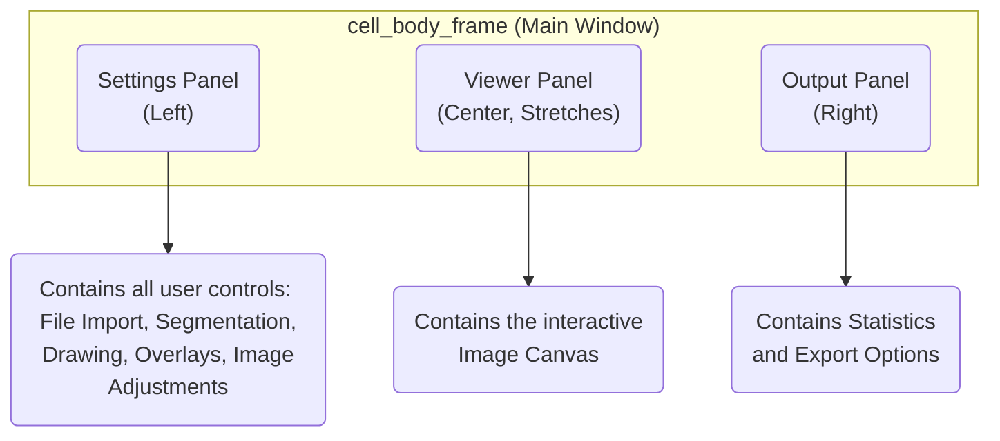
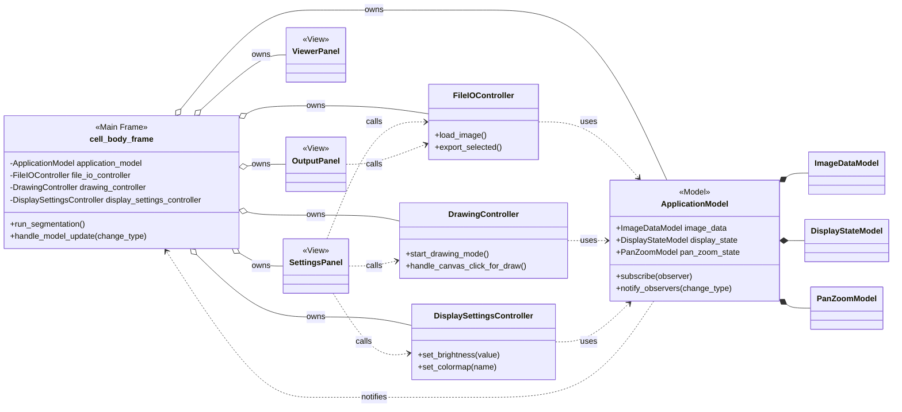
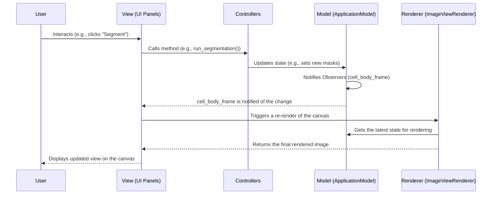
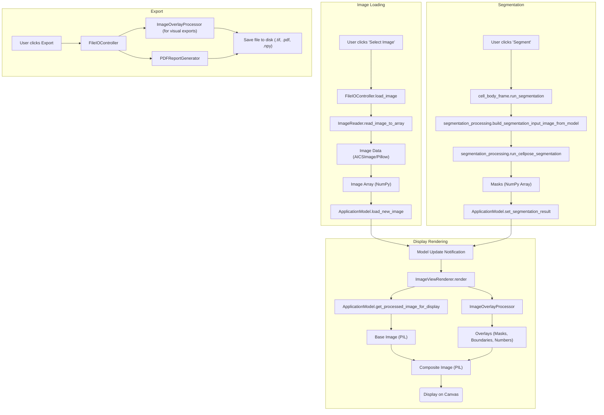
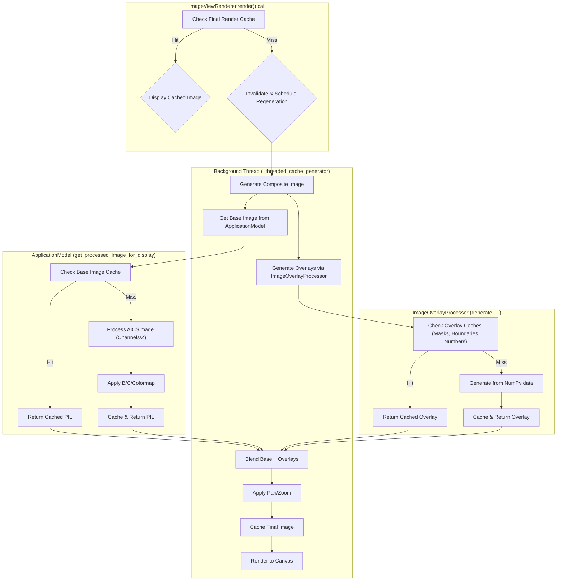

# Cell Body Detection Module Documentation

This document provides a detailed overview of the Cell Body Detection module, its architecture, data flow, and class structure.

## 1. Overview

The Cell Body Detection module is a graphical user interface (GUI) application designed for the analysis of microscopy images. Its primary functions are:

-   **Image Loading and Viewing**: Loading various microscopy image formats (including multi-channel and Z-stack files like `.lif`) and providing an interactive viewer with pan and zoom capabilities.
-   **Image Adjustment**: Adjusting display properties like brightness, contrast, and colormap for better visualization.
-   **Cell Segmentation**: Automatically identifying and creating masks for individual cell bodies using the Cellpose deep learning model.
-   **Manual Mask Creation/Editing**: Allowing users to manually draw polygon masks for cells or edit existing segmentation results by including/excluding cells.
-   **Data Export**: Exporting results in various formats, including segmentation masks as TIFF/NumPy files, the current view as a TIFF image, and comprehensive PDF reports with images and statistics.

The application is built using `customtkinter` for the UI and follows a design pattern that separates data state (Model), user interaction logic (Controllers), and the user interface (View), which promotes modularity and maintainability.

## 2. Setup and Running

To run the Cell Body Detection module, you need to have Python installed along with the required dependencies.

1.  **Set up a virtual environment** (recommended):
    ```bash
    python -m venv venv
    source venv/bin/activate  # On Windows, use `venv\Scripts\activate`
    ```

2.  **Install dependencies**:
    The required packages are listed in `requirements.txt`.
    ```bash
    pip install -r requirements.txt
    ```
    Key dependencies include:
    - `customtkinter`: For the user interface.
    - `cellpose`: For the core segmentation model.
    - `aicsimageio`: For reading microscopy file formats like `.lif`.
    - `numpy` & `Pillow`: For image data manipulation.
    - `reportlab`: For generating PDF reports.
    - `matplotlib`: Used for colormaps.

3.  **Run the application**:
    The main tool can be launched by running `microscopy_analysis_tool.py` from the project root.
    ```bash
    python microscopy_analysis_tool.py
    ```

## 3. Architecture and Data Flow

### High-Level Architecture

The application's architecture is a variant of the Model-View-Controller (MVC) pattern, adapted for a GUI application. It consists of four main layers:

-   **Model**: The single source of truth for the application's state. It knows nothing about the UI. When its data changes, it simply notifies its observers.
-   **View**: The user interface layer, composed of `customtkinter` widgets. It displays data from the Model and captures user interactions.
-   **Controller**: The logic layer that connects the View to the Model. When the user interacts with the View, the View calls a method in a Controller, which then updates the Model.
-   **Processing/Services**: A layer of specialized modules that handle heavy, isolated tasks like image processing, running AI models, or file generation. These are typically called by Controllers.

This separation ensures that data logic, business logic, and UI logic are decoupled, making the application easier to test, maintain, and extend.

### UI Structure

The main window (`cell_body_frame`) is divided into three primary panels.



### Class Relationships

The following diagram illustrates the relationships and dependencies between the major classes. The `cell_body_frame` acts as the central hub, creating and connecting all other components.



### User Interaction Flow

This sequence diagram shows the typical flow of interaction within the application.



### Data Processing Flow

This diagram shows how image data flows through the system, from initial loading to final export.



## 4. Class Reference

### Core Components

#### `cell_body_frame (cell_body.py)`

This is the main orchestrator of the Cell Body Detection module. It is a `ctk.CTkFrame` that houses all other UI components, models, and controllers.

-   **Responsibilities**:
    -   Initializes the `ApplicationModel` and all `Controllers`.
    -   Sets up the main UI layout, placing the `SettingsPanel`, `ViewerPanel`, and `OutputPanel`.
    -   Subscribes to `ApplicationModel` updates via the `handle_model_update` method, which acts as a central hub for reacting to state changes.
    -   Binds global keyboard shortcuts (e.g., undo/redo, pan/zoom keys) and mouse events on the canvas.
    -   Contains the top-level logic for initiating major actions like `run_segmentation`.

### Models (`/model`)

The model components are responsible for holding and managing the application's state.

#### `ApplicationModel (application_model.py)`

The heart of the application's state management.

-   **Responsibilities**:
    -   Holds instances of `ImageDataModel`, `DisplayStateModel`, and `PanZoomModel`.
    -   Implements the Observer pattern (`subscribe`, `unsubscribe`, `notify_observers`) to inform the UI of state changes.
    -   Manages the undo/redo history by recording state snapshots.
    -   Provides high-level methods to modify state, such as `load_new_image`, `set_segmentation_result`, `set_brightness`, etc. It also manages other state like the `segmentation_diameter`.
    -   Provides `get_processed_image_for_display`, which creates the base image view by applying channel and Z-stack settings from `DisplayStateModel`.

#### `ImageDataModel (image_data_model.py)`

Stores all data directly related to the loaded image and its analysis.

-   **State**: `original_image` (PIL), `mask_array` (NumPy), `included_cells` (set), `aics_image_obj`, file paths, and scale information. Note: `original_image` stores the current 2D PIL view of the image after any channel and Z-stack processing. It serves as the base for subsequent display adjustments like brightness and contrast, not necessarily the raw data from the file.
-   **Responsibilities**: Holds the raw multi-dimensional data (`aics_image_obj`), the derived 2D view for display (`original_image`), segmentation masks, cell selections, and calculated cell boundaries.

#### `DisplayStateModel (display_state_model.py)`

Stores the state of all UI controls related to image display and export options.

-   **State**: Brightness, contrast, colormap, channel configurations, Z-stack processing method, `scale_bar_microns`, and various boolean flags for showing/hiding overlays.
-   **Responsibilities**: Provides default values for all display settings and methods to reset them.

#### `PanZoomModel (pan_zoom_model.py)`

Manages the state of the interactive image viewer's viewport.

-   **State**: `zoom_level`, `pan_x`, `pan_y`, and `min_zoom_to_fit`.
-   **Responsibilities**: Calculates the minimum zoom to fit the image and validates pan/zoom updates.

### Controllers (`/controllers`)

Controllers bridge the gap between the UI (View) and the data (Model).

#### `FileIOController (file_io_controller.py)`

Handles all file input/output operations.

-   **Responsibilities**: Loading images via `ImageReader`, initiating exports of masks and reports, and handling mask uploads. It uses `ImageOverlayProcessor` and `PDFReportGenerator` to create the output files.

#### `DisplaySettingsController (display_settings_controller.py)`

Manages changes from the display adjustment UI controls.

-   **Responsibilities**: Converts UI-specific values (e.g., from sliders) to model-appropriate values and calls the appropriate setters on the `ApplicationModel`.

#### `DrawingController (drawing_controller.py)`

Manages the state and user interactions for manual mask drawing.

-   **Responsibilities**: Enters and exits "drawing mode", captures mouse clicks to create polygon points, manages a local undo/redo stack for the current drawing, and finalizes the polygon into a new mask in the `ApplicationModel`.

-   **State Flow**:
    ```mermaid
    stateDiagram-v2
        [*] --> Idle
        Idle --> Drawing: _start_drawing_mode()
        Drawing --> Drawing: handle_canvas_click_for_draw() [adds point]
        Drawing --> Drawing: _undo_draw_action()
        Drawing --> Drawing: _redo_draw_action()
        Drawing --> Finalized: _try_finalize_drawing() [len(points) >= 3]
        Drawing --> Idle: _cancel_drawing_action()
        Drawing --> Idle: _try_finalize_drawing() [len(points) < 3]
        Finalized --> Idle: (Mask created & mode reset)
    ```

### UI Components (`/ui`)

These classes define the visual and interactive elements of the application.

#### `BasePanel (base_panel.py)`
An abstract base class for `SettingsPanel` and `OutputPanel`. It inherits from `ctk.CTkScrollableFrame` and provides a helper method `_setup_traced_view_option_var` to simplify linking `customtkinter` variables to the `ApplicationModel`.

#### `SettingsPanel (settings_panel.py)`

The collapsible panel on the left containing most user controls.

-   **Responsibilities**: Creates widgets for file selection, history, model settings, mask creation, display adjustments, and overlay options. It connects widget actions to `Controller` methods and syncs its state with the `ApplicationModel`.

#### `OutputPanel (output_panel.py)`

The panel on the right for statistics and exporting.

-   **Responsibilities**: Displays statistics about the segmentation and provides buttons to trigger export functionalities in the `FileIOController`.

#### `ViewerPanel (viewer_panel.py)`

A container for the main image canvas.

-   **Responsibilities**: Creates the `ctk.CTkCanvas`, initializes the `ImageViewRenderer`, and binds canvas mouse events, forwarding them to `cell_body_frame` for handling.

#### `ImageViewRenderer (view_renderer.py)`

Responsible for orchestrating the rendering of the final image onto the canvas.

-   **Responsibilities**: Called by `cell_body_frame` when a re-render is needed. It gets the latest data from the model and calls `ImageOverlayProcessor` to generate the final composite image. It then handles the drawing of that image onto the canvas and manages caching to improve performance.

#### `ToolTip (tooltip.py)`
A simple helper class to create and display tooltips for `customtkinter` widgets upon hovering.

### Processing Modules (`/processing`)

These modules handle data-intensive operations.

#### `ImageOverlayProcessor (image_overlay_processor.py)`

A critical class for generating all visual elements overlaid on the base image. It is heavily optimized with caching.

-   **Responsibilities**: Generates colored PIL images for masks, single-pixel boundaries, and cell ID numbers. It blends these overlays with the base image, applies transformations (zoom, pan), and generates the final composite image for display or export. It also handles drawing the scale bar and diameter aid.

#### `segmentation_processing.py`

A collection of functions for running the Cellpose segmentation model.

-   **`run_cellpose_segmentation`**: Executes the Cellpose model on a NumPy image array.
-   **`build_segmentation_input_image_from_model`**: Prepares the image for segmentation, applying display adjustments if configured.
-   **`calculate_exact_boundaries_from_mask`**: Computes single-pixel-wide boundaries from a mask array.

### Utility Modules (`/utils`)

Helper classes and functions that provide supporting services.

#### `ImageReader (image_reader.py)`

A robust utility for reading various microscopy image file formats using the `aicsimageio` library. It can process multi-channel/Z-stack images and normalize them into a standard format.

#### `PDFReportGenerator (pdf_report_generator.py)`

Generates multi-page PDF reports summarizing the analysis using the `reportlab` library. It uses `ImageOverlayProcessor` to generate the images for the report.

#### `lasx_lif_image.py`
A fallback parser specifically for `.lif` files created by Leica's LAS X software, which can have non-standard dimension ordering that `aicsimageio` struggles with. This option is enabled by default in the constants file and should be disabled when processing `.lif` files that where not exported by LAS X.

#### `debug_logger.py`
A simple configurable logger used throughout the application to print debug, info, warning, or error messages to the console.

#### `constants.py`

A centralized file for all constant values: UI text, color codes, default settings, file types, and system messages. This simplifies maintenance and localization.

## 5. Advanced Topics

This section delves into more complex systems within the application that are crucial for its functionality and performance.

### Multi-Channel Image Display

The application supports multi-channel images (e.g., from `.lif` files) by providing a flexible way to map source image channels to colored "display channels".

-   **Display Slots**: The `DisplayStateModel` contains a list called `display_channel_configs`. Each item in this list represents a "display slot" with a specific color (e.g., Red, Green, Blue).
-   **Channel Mapping**: When a multi-channel image is loaded, `ApplicationModel.load_new_image` automatically maps the image's source channels to these display slots. For an image with N channels, the first N display slots are assigned `source_idx` values from 0 to N-1 and are activated for display.
-   **Rendering Process**: The core logic resides in `ApplicationModel.get_processed_image_for_display`. It generates the base 2D image that the user sees by performing the following steps:
    1.  It initializes an empty, black RGB image array.
    2.  It iterates through the `display_channel_configs` list.
    3.  For each "active" display slot that has a `source_idx` assigned, it retrieves the corresponding 2D image plane from the source `aics_image_obj`, applying the currently selected Z-stack processing method (slice, max project, or mean project).
    4.  This 2D plane is normalized to a floating-point range of `0.0` to `1.0`.
    5.  The normalized plane is then "colorized" by multiplying it with the display slot's assigned color (e.g., red `(1.0, 0, 0)`).
    6.  This colored plane is **additively blended** into the main RGB image array. This process allows multiple channels to be combined into a single composite view.
    7.  Finally, the resulting array is converted into a `PIL.Image`, which then has brightness, contrast, and colormap adjustments applied.

This system allows users to toggle channels on and off, or even assign a different source channel to a colored display slot, providing powerful visualization capabilities.

### Rendering and Caching Strategy

To maintain a responsive UI, especially during interactive operations like panning and zooming, the application employs a multi-level caching strategy. This system minimizes redundant computations and separates expensive operations into background threads.



The caching is broken down into three main levels:

**1. Base Processed Image Cache (`ApplicationModel`)**

This cache stores the final 2D `PIL.Image` after all channel mapping, Z-stack processing, brightness, contrast, and colormap adjustments have been applied. Its purpose is to prevent the entire image processing pipeline from re-running if only an overlay setting (like toggling cell numbers) changes. It's invalidated whenever any setting affecting the base image is altered (e.g., changing brightness, selecting a different Z-slice, or mapping a new channel).

**2. Overlay Layer Caches (`ImageOverlayProcessor`)**

This level caches individual `PIL.Image` representations for each overlay type (masks, boundaries) and the calculated screen positions for cell numbers. This avoids re-generating these visual layers from the raw `NumPy` mask array on every single frame, which can be computationally expensive. The cache is keyed by the set of cells being displayed and is invalidated when the underlying data changes, for example, when a new segmentation is run or a cell is selected/deselected.

**3. Final Composite Image Cache (`ImageViewRenderer`)**

This is the highest-level cache, storing the final, fully rendered image that is displayed on the canvas. This is the composite of the base image and all active overlays, transformed by the current pan and zoom settings. If it's valid, the `render` method can immediately draw the cached image to the canvas, resulting in the fastest possible redraw. The `ImageViewRenderer` listens for model updates. When a change occurs that requires a new render, it invalidates its own cache and spins up a background thread to re-create the composite image, preventing the UI from freezing.